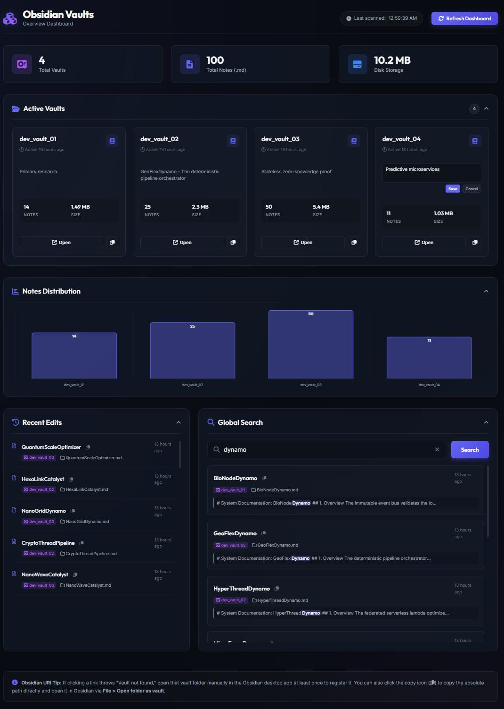

# Obsidian Vaults Overview Dashboard

A premium, local, self-contained web dashboard to oversee, monitor, and search across multiple Obsidian vaults from a single interface.

> [!IMPORTANT]
> The server will scan your peer directories ( skipping folders starting with `.` or `_`)
>
> ```
> Example folder structure
> My_Obsidian_Vaults
> ├── _My_Obsidian_Dashboard
> ├── dev_vault_01
> ├── dev_vault_02
> ├── dev_vault_03
> └── dev_vault_04
> ```

This dashboard is designed to run locally on your machine and treats all your Obsidian vault directories as **100% read-only**, ensuring no notes, configurations, or files are ever modified or corrupted.

<details>
  <summary>📸 Click to view dashboard previews</summary>
  <br>
  <p align="center">
    
  </p>
</details>

## ✨ Features

- **📊 Unified Vault Statistics**: Displays total vault counts, note counts (`.md`)~~, media files (`.png`, `.jpg`, `.pdf`, etc.),~~ and total disk storage usage across all active vaults in a central location.
- **📝 Local Vault Descriptions**: Add, edit, and save custom descriptions directly on each vault card. To respect the strict **read-only** nature of your vaults, descriptions are stored in a local, git-ignored configuration file (`vault-descriptions.json`), keeping your descriptions strictly private to your machine.
- **📈 Notes Distribution Chart**: Interactive bar chart displaying notes count across all vaults using a **logarithmic scale** to elegantly balance visual disparities (e.g. tracking a vault with 700 notes next to one with 5 notes).
- **🔗 Click-to-Open Obsidian URIs**: Click on a chart bar or card to launch that vault inside the Obsidian app immediately using path-based URIs (`obsidian://open?path=...`), bypassing pre-registration errors.
- **📋 Path Copy Fallbacks**: Includes one-click copy buttons next to all vaults and notes to copy absolute paths instantly to your clipboard.
- **🔍 Global Cross-Vault Search**: A powerful search bar to query terms across all markdown notes in all vaults simultaneously, displaying matching titles, locations, and snippets with query term highlights.
- **⏳ Recent Edits Timeline**: Displays a chronological feed of the most recently modified files across all vaults.
- **📁 Folding Collapsible Cards**: Collapse sections (Active Vaults, Chart, Recent Edits, Global Search) by clicking their headers to optimize dashboard space.
- **🎨 Premium UI**: Dark-mode glassmorphic interface built using harmonized HSL color variables, Outfit/Inter typography, responsive grid alignments, and subtle animations.

---

## 🛠️ Tech Stack

- **Backend**: Node.js (Express) to scan vault folders, cache statistics in memory, index markdown file paths, and serve API endpoints.
- **Frontend**: Single-page application using modern HTML5 semantic markup, custom Vanilla CSS, and JavaScript.
- **Libraries**: Chart.js (via CDN) for data visualization.

---

## 🚀 Getting Started

### 1. Prerequisites

- Make sure you have [Node.js](https://nodejs.org/) installed (v18+ recommended).
- **Tested Environments**: Windows 10/11 (PowerShell 7).

### 2. Installation

Clone the repository inside your Obsidian vaults parent folder or move the dashboard folder there:

```bash
git clone https://github.com/jeremywhalen/obsidian-vaults-dashboard.git _vault_dashboard
cd _vault_dashboard
npm install
```

### 3. Run the Server

Start the local server:

```bash
npm start
```

The server will scan your peer directories (skipping folders starting with `.` or `_`) and start hosting the API.

### 4. Open the Dashboard

Open your browser and navigate to:
**[http://localhost:3000](http://localhost:3000)**

---

## ⚙️ Running in the Background on Startup

If you want the dashboard to always run automatically in the background when your computer boots up, refer to the platform-specific guides in the [startup directory](startup/README.md).

## 🗺️ Roadmap & Changelog

### 🚀 Released

- [x] **v0.2.1** — _Documentation & Asset Cleanup_
  - 🧹 Deleted unused `assets/folder-structure.jpg` asset.
  - 📝 Fixed formatting of callouts and notes in `README.md`.
  - 📁 Added detailed folder structure guide and installation steps.
  - ⚙️ Added local `dev_notes/` folder to `.gitignore`.
- [x] **v0.2.0** — _Editable Local Vault Descriptions_
  - ✨ Implemented editable description cards utilizing a local, git-ignored `vault-descriptions.json` storage model to protect vault privacy.
  - 📝 Documented local vault customization features in the master layout.
- [x] **v0.1.0** — _Initial Development Baseline_
  - 📊 Built core dashboard rendering multi-vault tracking statistics.
  - 📈 Implemented logarithmic scale charts via Chart.js for balanced note distribution views.
  - 🔗 Integrated path-based Obsidian URIs (`obsidian://open?path=...`) for instant, error-free vault switching.
  - 🔍 Added global cross-vault markdown query search engine.

---

### ⏳ Upcoming Features

- [ ] **v0.2.2** — **Add Media File Count**: Add media file count to the dashboard.
- [ ] **v0.2.3** — **Add Folder Blacklist Filter**: Add a configuration option to manually exclude specific folder paths from cross-vault scanning.
- [ ] **v0.2.4** — **Add File Extension Exclusions**: Implement rules to filter out system meta-files (e.g., `.DS_Store`) from media totals.
- [ ] **v0.2.5** — **Add Mobile-Responsive Optimization**: Refine glassmorphic CSS grids to adapt fluidly across mobile and tablet viewports.
- [ ] **v0.2.6** — **Add Automated Release Pipeline**: Implement automated version tagging and release generation using GitHub Actions workflows.
- [ ] **v0.2.7** — **Add Obsidian Plugin Integration**: Long-term exploration into compiling this into a native Obsidian community plugin wrapper.
